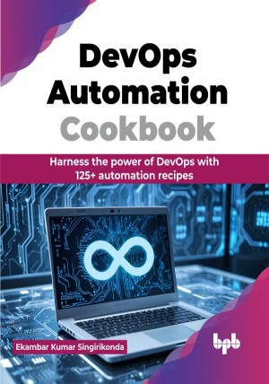

# DevOps Automation Cookbook

Automate, scale, and secure your DevOps workflows like a pro

This is the repository for [DevOps Automation Cookbook
](https://bpbonline.com/products/devops-automation-cookbook),published by BPB Publications.

## About the Book
In the fast-paced world of software development, embracing DevOps practices is key to achieving rapid, reliable deployments. The DevOps Automation Cookbook equips you with a comprehensive toolkit to automate and streamline your workflows, from infrastructure provisioning to continuous integration and deployment.

This book teaches readers how to automate infrastructure setup and deployment using IaC tools like Terraform and Ansible. It covers essential DevOps practices such as version control with Git, continuous integration with Jenkins or Travis, and automated testing with Selenium. The book also explains containerization with Docker and orchestration with Kubernetes for efficient app deployment. It highlights DevSecOps, focusing on security with Puppet, and explores using TeamCity for enforcing compliance policies in the DevOps workflow.

Whether you are a seasoned DevOps practitioner or just starting your journey, the DevOps Automation Cookbook provides the insights and hands-on skills you need to take your automation game to the next level. Discover how to optimize your processes, scale your infrastructure, and deliver high-quality software faster than ever before.

## What You Will Learn
• Automate infrastructure provisioning with Terraform and Ansible.

• Implement version control and collaboration with Git.

• Set up efficient CI/CD pipelines using Jenkins.

• Leverage containers with Docker and orchestrate with Kubernetes.

• Integrate automated testing and security into DevOps workflows.

• Apply configuration management using Puppet and Chef.
